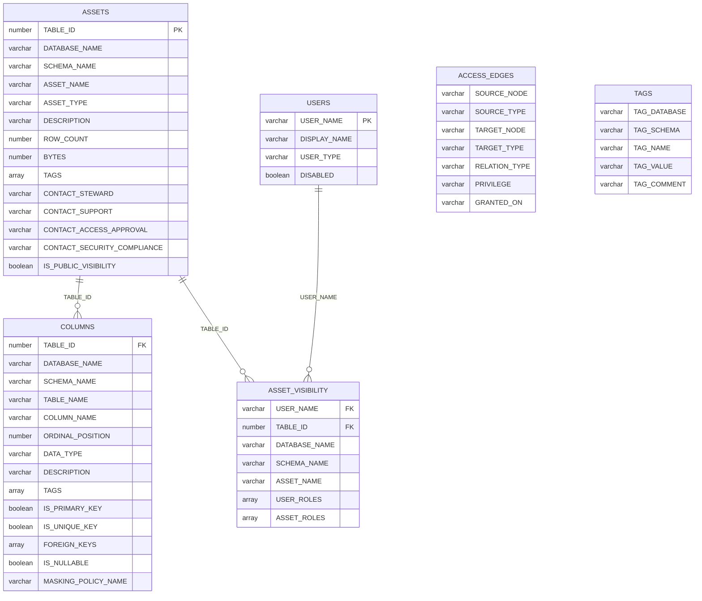

# Design Model

表示用に用意されるデータカタログ・テーブルの定義。

## ER diagram



- 実際のテーブルには制約は付与されていない
  - テーブルは `create or replace` により都度生成され、その際に制約の定義は喪失してしまうため未付与としている
  - 上記の ER diagram での情報は、論理上での情報となる
- `ACCESS_EDGES` テーブルは、`SOURCE_NODE` / `TARGET_NODE` 列に格納された USER 名 / ロール名 / データ資産 FQN の値で他テーブルと結合する
  - そのため ER diagram では上は独立エンティティとして表現している
- `TAGS` テーブルは検索プルダウン用のマスターで、他テーブルの `TAGS` 列と論理的に対応する独立エンティティとなる

## データソース定義

各カタログテーブルの列が、どの Snowflake 情報源より作成されるかを示す。

情報源は `SNOWFLAKE.ACCOUNT_USAGE.*` ビュー、または `SHOW` コマンド結果からとなる。

### ASSETS

| 列 | ソース | 変換 / 導出 |
| --- | --- | --- |
| TABLE_ID | TABLES.TABLE_ID | そのまま |
| DATABASE_NAME | TABLES.TABLE_CATALOG | そのまま |
| SCHEMA_NAME | TABLES.TABLE_SCHEMA | そのまま |
| ASSET_NAME | TABLES.TABLE_NAME | そのまま |
| ASSET_TYPE | TABLES.IS_DYNAMIC / IS_ICEBERG / IS_HYBRID / TABLE_TYPE | case 式で導出（本書「ASSET_TYPE 列の求め方」参照） |
| DESCRIPTION | TABLES.COMMENT | そのまま |
| ROW_COUNT | TABLES.ROW_COUNT | そのまま |
| BYTES | TABLES.BYTES | そのまま |
| TAGS | TAG_REFERENCES（DOMAIN = TABLE） | object の array に集約（重複排除） |
| CONTACT_STEWARD | CONTACT_REFERENCES.CONTACT_NAME | CONTACT_PURPOSE で 4 列にピボット |
| CONTACT_SUPPORT | CONTACT_REFERENCES.CONTACT_NAME | CONTACT_PURPOSE で 4 列にピボット |
| CONTACT_ACCESS_APPROVAL | CONTACT_REFERENCES.CONTACT_NAME | CONTACT_PURPOSE で 4 列にピボット |
| CONTACT_SECURITY_COMPLIANCE | CONTACT_REFERENCES.CONTACT_NAME | CONTACT_PURPOSE で 4 列にピボット |
| IS_PUBLIC_VISIBILITY | GRANTS_TO_ROLES（grantee = PUBLIC, SELECT/OWNERSHIP） | 該当有無を boolean 導出 |

### COLUMNS

| 列 | ソース | 変換 / 導出 |
| --- | --- | --- |
| TABLE_ID | ASSETS | 名前（DB/スキーマ / テーブル）で ASSETS に結合し付与 |
| DATABASE_NAME | COLUMNS.TABLE_CATALOG | そのまま |
| SCHEMA_NAME | COLUMNS.TABLE_SCHEMA | そのまま |
| TABLE_NAME | COLUMNS.TABLE_NAME | そのまま |
| COLUMN_NAME | COLUMNS.COLUMN_NAME | そのまま |
| ORDINAL_POSITION | COLUMNS.ORDINAL_POSITION | そのまま |
| DATA_TYPE | COLUMNS.DATA_TYPE | そのまま |
| DESCRIPTION | COLUMNS.COMMENT | そのまま |
| TAGS | TAG_REFERENCES（DOMAIN = COLUMN） | object の array に集約（重複排除） |
| IS_PRIMARY_KEY | SHOW PRIMARY KEYS | 該当有無を boolean 導出 |
| IS_UNIQUE_KEY | SHOW UNIQUE KEYS | 該当有無を boolean 導出 |
| FOREIGN_KEYS | SHOW IMPORTED KEYS（PK_* 列 = 参照先） | 参照先 object の array に集約 |
| IS_NULLABLE | COLUMNS.IS_NULLABLE | `'YES'` → true の boolean 導出 |
| MASKING_POLICY_NAME | POLICY_REFERENCES.POLICY_NAME（POLICY_KIND = MASKING_POLICY） | そのまま |

### USERS

| 列 | ソース | 変換 / 導出 |
| --- | --- | --- |
| USER_NAME | USERS.NAME | そのまま |
| DISPLAY_NAME | USERS.DISPLAY_NAME | そのまま |
| USER_TYPE | USERS.TYPE | null は `PERSON` に正規化 |
| DISABLED | USERS.DISABLED | boolean |

`USERS` には、現時点で利用しない Snowflake 側の ID 列を持たない。
画面表示・検索・権限経路の結合では `USER_NAME` を利用する。
ただし `USER_NAME` はメールアドレス等の個人情報に近い値を含み得るため、URL query parameter 等の外部に残りやすい場所へ露出させない。
ページ間遷移は Streamlit の `session_state` による一時的な状態受け渡しで扱う。

### ACCESS_EDGES

| 列 | ソース | 変換 / 導出 |
| --- | --- | --- |
| （全列） | GRANTS_TO_USERS / GRANTS_TO_ROLES | USER_TO_ROLE / ROLE_TO_ROLE（USAGE のみ）/ ROLE_TO_ASSET（SELECT・OWNERSHIP）を union。DB ロールは `DB.ROLE` で修飾、PUBLIC は除外 |

### ASSET_VISIBILITY

| 列 | ソース | 変換 / 導出 |
| --- | --- | --- |
| （全列） | ACCESS_EDGES | 再帰 CTE で user→asset の到達ペアを生成。USER_ROLES = user から 1 hop の起点ロール、ASSET_ROLES = 資産に直接権限を持つロール |

### TAGS

| 列 | ソース | 変換 / 導出 |
| --- | --- | --- |
| TAG_DATABASE | TAGS.TAG_DATABASE | そのまま |
| TAG_SCHEMA | TAGS.TAG_SCHEMA | そのまま |
| TAG_NAME | TAGS.TAG_NAME | そのまま |
| TAG_VALUE | TAGS.ALLOWED_VALUES | 配列を flatten して 1 値 1 行に展開 |
| TAG_COMMENT | TAGS.TAG_COMMENT | タグ定義のコメント。検索 UI の補助説明に利用 |

なお `allowed_values` 未定義（自由記述）のタグは値を列挙できないため、本マスターには現れない。
`TAGS` には、現時点で利用しない Snowflake 側の ID 列を持たない。
タグは `TAG_DATABASE` / `TAG_SCHEMA` / `TAG_NAME` / `TAG_VALUE` の組み合わせを検索 UI 用の値として扱う。
`TAG_COMMENT` は同一タグの各 `TAG_VALUE` 行に同じ値を保持する。

## 収集対象 データベース

[SNOWFLAKE.ACCOUNT_USAGE.DATABASES](https://docs.snowflake.com/en/sql-reference/account-usage/databases) の情報より、以下を満たすもの。

- `DELETED` が null
- `TYPE` が `STANDARD` のもの

## 収集対象 Snowflake ユーザー

[SNOWFLAKE.ACCOUNT_USAGE.USERS](https://docs.snowflake.com/en/sql-reference/account-usage/users) の情報より、以下を満たすもの。

- `DELETED_ON` が null
- [TYPE](https://docs.snowflake.com/en/user-guide/admin-user-management#label-user-management-types) が以下
  - PERSON
  - NULL (PERSON と同義)
  - SERVICE
  - LEGACY_SERVICE

## `ASSETS` テーブル `ASSET_TYPE` 列の求め方

以下のロジックによる。

```sql
select 
    case 
        when is_dynamic = 'YES' then 'DYNAMIC TABLE'
        when is_iceberg = 'YES' then 'ICEBERG TABLE'
        when is_hybrid  = 'YES' then 'HYBRID TABLE'
        else table_type -- BASE TABLE, VIEW, MATERIALIZED VIEW, EXTERNAL TABLE, EVENT TABLE, TEMPORARY TABLE
    end as asset_type
from 
    SNOWFLAKE.ACCOUNT_USAGE.TABLES
```

## データ資産を「閲覧可能」と判定する定義

対象の「データ資産」に対して、以下の権限がある場合。

- OWNERSHIP
- SELECT

実際の参照には USAGE も必要であるが、付与済みであると前提して、SELECT/OWNERSHIP のみで判定する。

### `PUBLIC` ロールの扱い

以下の条件に合致する「データ資産」は `ASSETS` テーブルのカラム `IS_PUBLIC_VISIBILITY` を `TRUE` として管理する。

- 以下の権限をもった PUBLIC ロールが付与されている
  - OWNERSHIP
  - SELECT

また、`ASSET_VISIBILITY` および `ACCESS_EDGES` テーブルには PUBLIC 由来の情報を収集しない。

- 画面上で `IS_PUBLIC_VISIBILITY` を個別に表示し、ユーザー一覧との union は行わない方針とする
  - [design-view.md](design-view.md) 参照
- グラフ描画（`ACCESS_EDGES`）でも PUBLIC は扱わない

### その他の、システム定義ロールの扱い

下記の [Snowflake システム定義ロール](https://docs.snowflake.com/ja/user-guide/security-access-control-overview#system-defined-roles) を介して「閲覧可能」となる場合も対象とする。

- ACCOUNTADMIN
- SECURITYADMIN
- USERADMIN
- SYSADMIN

グラフ描画用の情報も、カスタムロール（アカウントロール / データベースロール）と同様に管理する。

なお、ここでの「閲覧可能」判定は、記録された権限付与とロール継承の経路に基づく。つまり、ACCOUNTADMIN 等が持つ、明示的な権限付与を伴わない暗黙的な全参照権限（スーパーユーザー的アクセス）は対象外とする。

### ロール階層の探索深度

Snowflake ではロールの循環参照がシステム上で禁止されるため、ロールの多段継承を、深さ無制限で全段を探索する方針とする。
