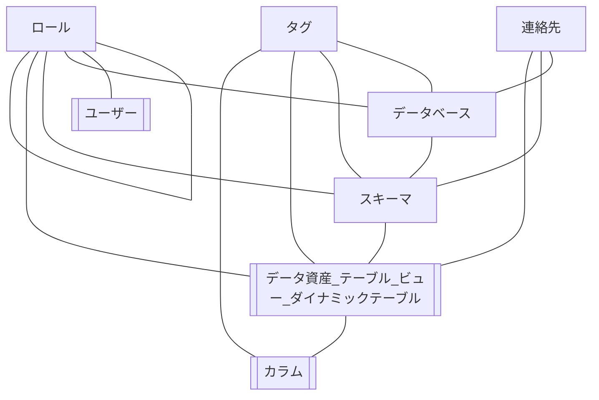
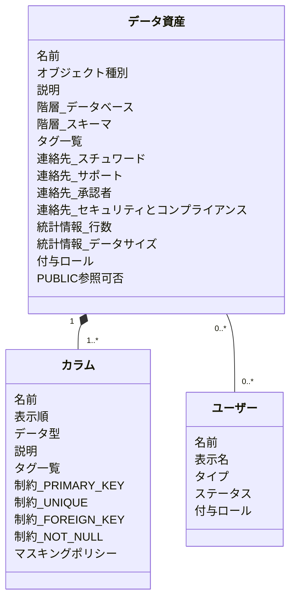
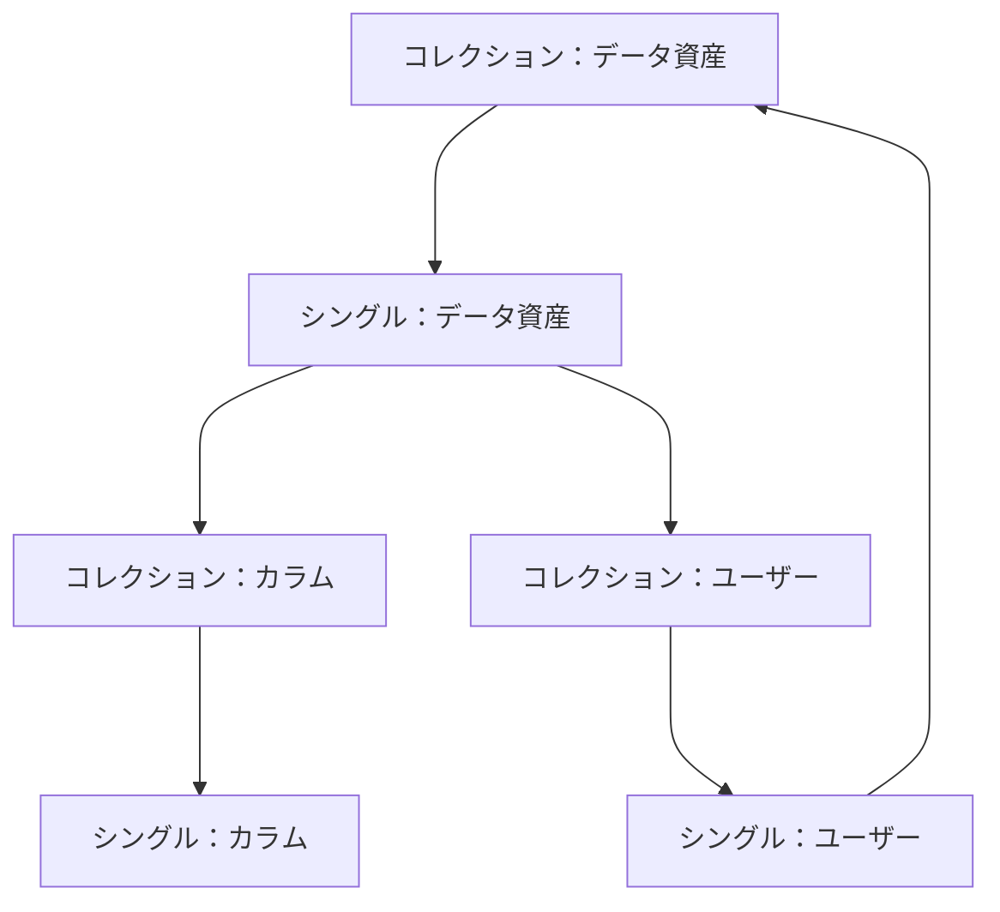

# Design View

画面設計書にあたる資料。

## 画面設計の方針

オブジェクト指向 UI デザイン（OOUI）の設計手法を採用する。

## 画面要求

### 必須要求

- テーブル / ビュー / ダイナミック・テーブル / カラムに設定されている、以下の情報を参照できる
  - 説明
  - タグ
  - 連絡先（※テーブル / ビュー / ダイナミック・テーブルのみ）
- テーブル / ビュー / ダイナミック・テーブルの統計情報の参照できる
- テーブル / ビュー / ダイナミック・テーブルの閲覧可能 Snowflake ユーザーを参照できる
- 以下情報による、検索・フィルタリング表示が可能
  - フリーワード
  - 階層（データベース / スキーマ）
  - オブジェクト種別
  - タグ

### 不要要求

- データのプレビュー参照
- データリネージの参照
- データカタログ情報の更新機能

## オブジェクト関係図

以下をメインオブジェクトとして扱う。

- データ資産_テーブル_ビュー_ダイナミックテーブル
- カラム
- ユーザー



`データ資産_テーブル_ビュー_ダイナミックテーブル` は、以降 `データ資産` として扱う。

## メインオブジェクト関係図



各属性の表示データは [design-model.md](design-model.md) を参照。

## ビューのナビゲーション



## ルートナビゲーション項目

- データ資産
- ユーザー

## ルートナビゲーション項目の配置先

- `st.navigation` + `st.Page` によるナビゲーションに配置する
  - ルートナビゲーションは `st.navigation(pages, position="top")` で画面上部に配置する
  - ページ本体は `streamlit/views/`（ASCII 名のファイル）に置き、表示名（日本語）は
    エントリポイント（`streamlit_app.py`）の `st.Page(..., title=...)` で与える
  - `pages/` ディレクトリの自動ナビゲーションは用いない（ファイル名から日本語を排すため）
  - NOTE: [st.navigation](https://docs.streamlit.io/develop/api-reference/navigation/st.navigation)

## 作成画面 / 画面レイアウト

原則、空状態や未設定値を表示する場合には、画面を崩さず、空欄で表示する。
ページ本文の下余白は `stMainBlockContainer` の `padding-bottom: 32px` に抑える。
`st.title` / `st.subheader` の自動 anchor link は、画面内リンクとして意味を持たないため非表示にする。

### page：データ資産

[streamlit/settings.py](../streamlit/settings.py) の `DISPLAY_SCOPES` で定義されたデータベース / スキーマに所属するもののみ表示する。

#### 画面レイアウト

- 検索 UI は `st.sidebar` に配置する
- ページ本文は full width の main pane として扱う

#### 初期画面

- sidebar
  - `コレクション：データ資産` 検索向け画面
    - 設置する検索機能については [docs/design-search](design-search.md) を参照
- main pane
  - `コレクション：データ資産` 検索結果の一覧画面
    - `st.dataframe`
    - 表示列は「データベース」「スキーマ」「名前」「オブジェクト種別」「説明」とする
  - 初期状態では空欄表示（検索条件が未入力の間は一覧を出さない）
    - 検索は入力に応じてインタラクティブに反映する（明示の「検索」ボタンは設けない）
    - 検索入力を一括初期化する「入力をクリア」ボタンを設ける
  - 検索条件が入力されているが検索結果が 0 件の場合は、空の dataframe ではなく空状態メッセージを表示する
  - ソート順
    1. 階層_データベース
    2. 階層_スキーマ
    3. 名前
  - pagination は行わず、`st.dataframe` のスクロール / fullscreen 表示に委ねる

#### 詳細画面

- 表示「データ資産」のセルクリックにて、main pane を左右分割し、右側カラムにクリックした「データ資産」の詳細ペインを表示する
  - 左右分割の比率は  `st.columns([1, 3])` とする
  - `st.dataframe(df, selection_mode="single-cell", on_select="rerun")` を標準とする
    - `single-row`（左端チェック列）ではセル本文クリックで選択できないため、`single-cell` を採用し
      `event.selection.cells`（`[(行位置, 列名)]`）の行位置から選択行 ID（`TABLE_ID` / `USER_NAME`）を得る
    - 選択行 ID を `st.session_state` に保存してから詳細ペインを描画する
    - `event.selection.cells` が空の rerun は「詳細を閉じる」意思とは扱わず、既存の選択 state を維持する
  - 詳細ペインには「閉じる」ボタンを設け、選択を解除して一覧のみの表示へ戻せるようにする
    - 閉じるボタンは詳細ペイン上部の見出し行右端に primary のアイコンボタンとして配置する
  - 詳細ペイン表示時の左側一覧は、狭い領域でも読みやすいよう「名前」列のみ表示する
- 詳細ペイン上部
  - `シングル：データ資産` の名前
  - `シングル：データ資産` の説明
  - `シングル：データ資産` の階層
  - `シングル：データ資産` のオブジェクト種別（badge 表示）
  - `シングル：データ資産` のタグ（タグキーごとに安定した色の badge 表示）
  - `シングル：データ資産` の PUBLIC 参照可否（badge 表示）
- 詳細ペイン下部
  - タブ (`st.tabs`) により表示情報を管理する
    - タブ: カラム
      - `st.dataframe` で `コレクション：カラム` を表示する
      - 通常表示では「位置」「名前」「説明」が見えることを優先し、詳細確認は dataframe の fullscreen 表示に委ねる
      - 表示列は「位置」「名前」「説明」「型」「PKEY」「NOT NULL」「UNIQUE」「外部 KEY」「マスキングポリシー」「タグ」とする
      - `マスキングポリシー` はポリシー名ではなく有無を boolean で表示する
    - タブ: 連絡先
      - `st.dataframe` で `シングル：データ資産` の各連絡先を表示する
    - タブ: 統計情報
      - `st.dataframe` で `シングル：データ資産` の統計情報を表示する
    - タブ: ユーザー
      - 以下情報を `st.dataframe` で表示する
        - `ASSET_VISIBILITY` テーブルより、表示中データ資産を閲覧可能なユーザーの行
          1. `USER_NAME` 列
          2. `USER_ROLES` 列
             - 列名を「ユーザー付与ロール」に変更し、配列を `aaa, bbb` と文字列表現
          3. `ASSET_ROLES` 列
             - 列名を「データ資産付与ロール」に変更し、配列を `aaa, bbb` と文字列表現
      - `st.dataframe` の行を選択してから「ロール継承グラフを表示」ボタンを押した場合、ロール継承グラフページへ遷移する
        - 選択行の `USER_NAME` から表示中データ資産までを辿ったロール継承 graph (選択行の USER_NAME から表示中データ資産までの全経路 graph) を表示する
      - ユーザーページへの遷移は、dataframe のセル選択ではなく「選択ユーザーを開く」ボタンで行う
      - 操作ボタンは dataframe の上に 2 つ横並びで表示し、「ロール継承グラフを表示」は右側に配置する
      - なお、[streamlit/settings.py](../streamlit/settings.py) の `IS_VISIBLE_ONLY_SELF_USER` が True の場合、表示ユーザーを Snowflake ログインユーザーのみに絞って表示する
        - Snowflake ログインユーザー名を取得できない場合は一覧を表示しない
  - ユーザーページから遷移した場合、検索条件が未指定でも詳細ペインを表示する
    - この場合も `st.columns([1, 3])` の左右分割を使い、左側には一覧の代わりに「検索条件が未指定のため、一覧は非表示です。」を表示する

### page：ユーザー

#### 画面レイアウト

- 検索 UI は `st.sidebar` に配置する
- ページ本文は full width の main pane として扱う

#### 初期画面

- sidebar
  - `コレクション：ユーザー` 検索向け画面
    - 設置する検索機能については [docs/design-search](design-search.md) を参照
- main pane
  - `st.dataframe` で `コレクション：ユーザー` 検索結果の一覧画面を表示する
  - 初期状態では全ユーザーを表示
  - ソート順
    1. 名前
  - pagination は行わず、`st.dataframe` のスクロール / fullscreen 表示に委ねる

#### 詳細画面

- 表示「ユーザー」のセルクリックにて、main pane を左右分割し、右側カラムにクリックした「ユーザー」の詳細ペインを表示する
  - 左右分割の比率は  `st.columns([1, 3])` とする
  - データ資産ページと同様に `st.dataframe(df, selection_mode="single-cell", on_select="rerun")` を標準とし、
    `event.selection.cells` の行位置から選択行 ID（`USER_NAME`）を得て `st.session_state` に保存してから詳細ペインを描画する
  - `event.selection.cells` が空の rerun は「詳細を閉じる」意思とは扱わず、既存の選択 state を維持する
  - 詳細ペインには「閉じる」ボタンを設け、選択を解除して一覧のみの表示へ戻せるようにする
    - 閉じるボタンは詳細ペイン上部の見出し行右端に primary のアイコンボタンとして配置する
- 詳細ペイン上部
  - `シングル：ユーザー` の名前
  - `シングル：ユーザー` の表示名（太字表示）
  - `シングル：ユーザー` のタイプ（badge 表示）
    - `NULL` / 空は `PERSON` と同義として表示する
  - `シングル：ユーザー` のステータス（badge 表示）
- 詳細ペイン下部
  - 以下情報を `st.dataframe` で表示する
    - `ASSET_VISIBILITY` テーブルより、表示中ユーザーが閲覧可能なデータ資産の行
      1. `DATABASE_NAME` 列
         - 列名を「データベース」に変更する
      2. `SCHEMA_NAME` 列
         - 列名を「スキーマ」に変更する
      3. `ASSET_NAME` 列
         - 列名を「名前」に変更する
      4. `USER_ROLES` 列
         - 列名を「ユーザー付与ロール」に変更し、配列を `aaa, bbb` と文字列表現
      5. `ASSET_ROLES` 列
         - 列名を「データ資産付与ロール」に変更し、配列を `aaa, bbb` と文字列表現
  - `st.dataframe` の行を選択してから「ロール継承グラフを表示」ボタンを押した場合、ロール継承グラフページへ遷移する
    - 表示中ユーザーから選択行データ資産までを辿ったロール継承 graph を表示する
  - データ資産ページへの遷移は、dataframe のセル選択ではなく「選択データ資産を開く」ボタンで行う
  - 操作ボタンは dataframe の上に 2 つ横並びで表示し、「ロール継承グラフを表示」は右側に配置する

### page：ロール継承グラフ

#### 画面レイアウト

- `st.navigation` の 1 ページとして配置する
  - `st.Page(..., visibility="hidden")` とし、root navigation には表示しない
- assets / users 画面から `session_state` に以下を積んで `st.switch_page("views/graph.py")` で遷移する
  - `nav_graph_user_name`
  - `nav_graph_table_id`
  - `nav_graph_asset_fqn`
- query parameter は利用しない
- graph ページでは検索 UI を持たないため、ページ限定 CSS で空の `st.sidebar` を非表示にする

#### 表示内容

- 表示中の対象ユーザー・対象データ資産を上部に表示する
- 「ユーザーを開く」「データ資産を開く」ボタンを設け、それぞれの詳細ページへ戻れるようにする
- `ACCESS_EDGES` から対象ユーザー -> 対象データ資産の全経路を探索する
- graph 描画は `st.graphviz_chart` を利用する
- 経路数が多すぎる場合は graph を描画せず、「経路が多すぎるため表示できません。」を表示する
- 経路が見つからない場合は、「ロール継承 graph の経路が見つかりませんでした。」を表示する

## 画面遷移図

```Mermaid
flowchart LR

  asset["データ資産"]
  user["ユーザー"]
  graph["ロール継承グラフ"]

  asset --行選択後「選択ユーザーを開く」--> user
  user --行選択後「選択データ資産を開く」--> asset
  asset --行選択後「ロール継承グラフを表示」--> graph
  user --行選択後「ロール継承グラフを表示」--> graph
  graph --ユーザーを開く--> user
  graph --データ資産を開く--> asset
```

- `st.session_state` に「遷移先で選択させたい ID」を積んで `st.switch_page()` で移動する
- `st.session_state` のキーは接頭辞で名前空間を分ける
  - 例：`asset_selected_table_id` / `user_selected_name` / `search_*` / `nav_to_table_id` / `nav_to_user_name` / `nav_graph_*`
- ブラウザの「戻る」ボタンによる状態復元は保証しない
- URL query params はページ間状態管理に利用しない
- ページ間遷移は dataframe の暗黙的なセルクリックではなく、明示的なボタン操作で行う

## 配色

- 標準カラーは Snowflake コーポレートカラー（水色 `#29B5E8`）に寄せる
- `.streamlit/config.toml` の `[theme]`（`base = "light"` / `primaryColor = "#29B5E8"`）で指定する

## 言語

### UI 画面

「日本語」で固定。

### エラーメッセージ

- main pane に、日本語のエラーメッセージ ([st.error](https://docs.streamlit.io/develop/api-reference/status/st.error#sterror)) を表示
- traceback 等のシステム内部情報は原則表示しない
  - `CATALOG_DATA_MODE=fake` のローカル開発時のみ、原因調査のため `st.exception` で表示してよい
